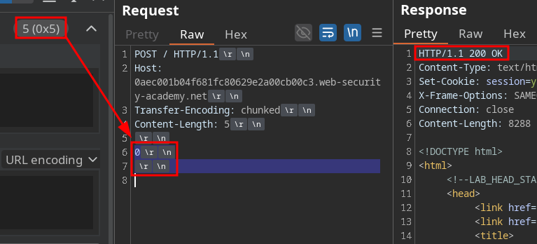
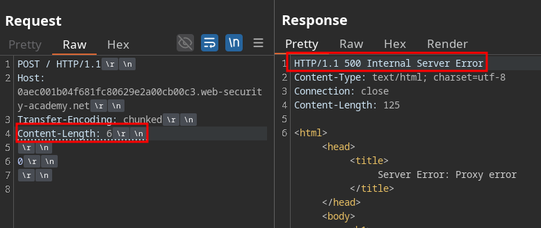
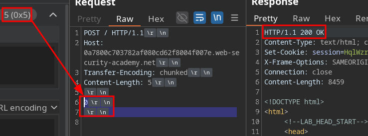
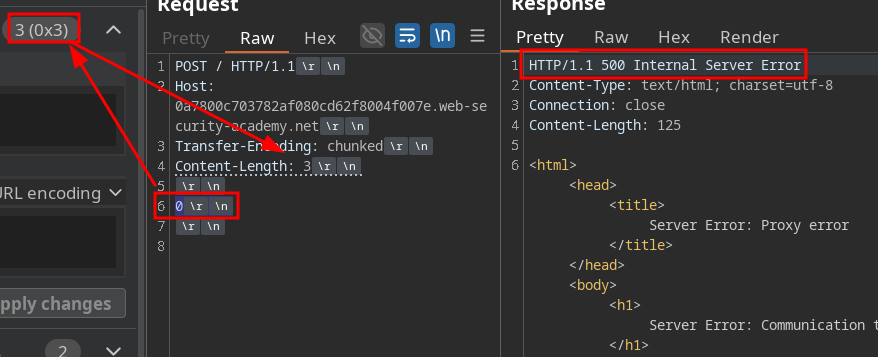

# HTTP REQUEST SMUGGLING- CHEATSHEET + MOST IMPORTANT LABS

## Index


- [HOW DESYNC CL-TE TO DETECT CL-TE + POC](#how-desync-cl-te-to-detect-cl-te--poc)
- [HOW DESYNC TE-CL TO DETECT TE-CL + POC](#how-desync-te-cl-to-detect-te-cl--poc)
- [MOST IMPORTANT LABS](#walkthrough---most-important-labs)

## Key Terms

```
- Content Length    -> size in decimal
- Transfer Encoding -> size in hexadecimal
- HTTP 2 -> CL inferred from data frames
- CRLF (Carriage Return Line Feed) Injection 
- Response queue poisoning
```

## Walkthrough - Most Important Labs


- [CL.TE to obtain custom header via SSRF](CL.TL-to-reveal-custom-heaeder-via-ssrf.md)
- [CL.TE to steal cookie via post comment](CL-TL-to-steal-cookie.md) ❗
- [CL.TE + XSS in UserAgent to steal cookie](CL-TL-XSS-steal-cookie.md) ❗

- [H2.TE response queue poisoning](H2.T2.queue.md)
- [HTTP/2 - CRLF injection + EXTRA](HTTP2-CRLF.md)

## Methodology

```bash
- 1 -> downgrade to HTTP/1.1 -> switch to POST && remove headers -> disable CL auto-refresh -> show non-printable characters
- 2 -> Http Request Smuggler -> HTTP1 / HTTP2
- 3 -> Detect vulnerability type

```

bypass TE blocked
```bash
Transfer-Encoding: chunked
Transfer-encoding: error
```


#### HOW DESYNC CL-TE TO DETECT CL-TE + POC


Scenario 1: Successful Synchronization (5 Bytes)

    Front-end (CL): Forwards exactly 5 bytes (0\r\n\r\n).

    Back-end (TE): Receives the full zero-length chunk structure.

    Result: The request terminates correctly. HTTP 200 OK




Scenario 2: Forced Desynchronization (3 Bytes)

    Front-end (CL): Only forwards the first 3 bytes (0\r\n) based on your header.

    Back-end (TE): Processes the 0\r\n but hangs while waiting for the mandatory second \r\n to close the message.

    Result: The connection times out due to missing data. HTTP 500 Internal Server Error.





> POC


#### HOW DESYNC TE-CL TO DETECT TE-CL + POC


Scenario 1: Successful Synchronization

To get a 200 OK, both servers must agree on where the request ends.

    Front-end (TE): Sees chunked and reads until the 0\r\n\r\n.

    Back-end (CL): We set the Content-Length to exactly match the total bytes of the chunked body.

    Result: Both process the same data. The request is clean.





Scenario 2: Forced Desynchronization (The "Starvation" / Timeout)

To replicate the "Internal Server Error" (Timeout) you achieved in CL-TE, you do the following:

    Front-end (TE): You send a valid chunked structure (e.g., 0\r\n\r\n). The front-end sees this and forwards it.

    Back-end (CL): You set a Content-Length that is larger than what the front-end actually sends (e.g., Content-Length: 6).

    The Conflict: The back-end receives the 5 bytes from the front-end but stays "hungry" for the 6th byte.

    Result: Since the front-end has already closed the request and the back-end is still waiting for more data, the connection eventually drops. HTTP 500 Internal Server Error / Gateway Timeout.





> POC


