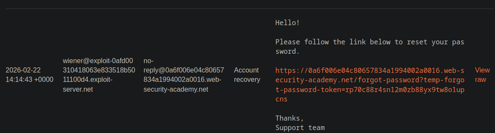
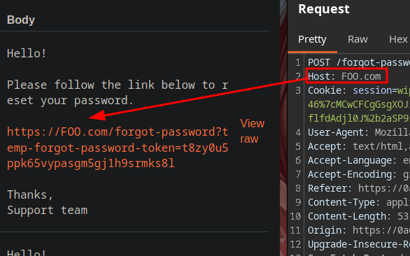
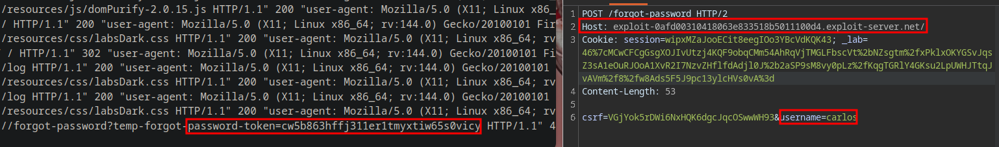

# Password Reset Poisoning via Host Header Exploitation

In this lab, we exploit a vulnerability within the password reset functionality.

The server relies on the Host header to generate the password recovery link (header value + reset endpoint), which is then emailed to the victim.

By manipulating the Host header and replacing it with our controlled exploit server, we can intercept the reset link. When the victim clicks the link in the email, their reset token is leaked to our server logs. We then use this captured token to change the victim's password and gain unauthorized access to their account.

