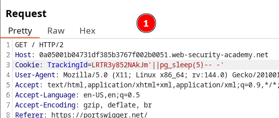
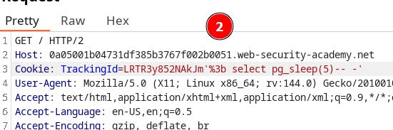
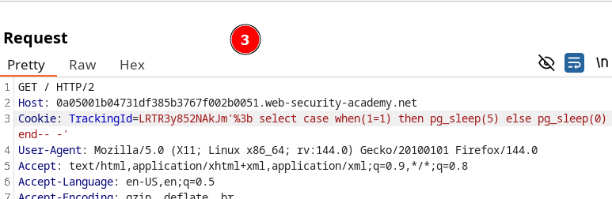
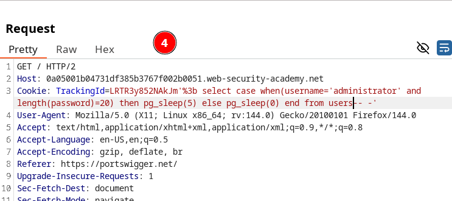
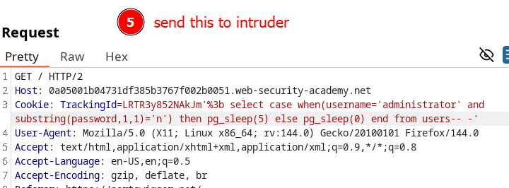

# Blind SQL injection with time delays and information retrieval

In this lab, we observe that the application does not return any visible response to traditional SQL injection techniques, but we discover that it is possible to trigger time delays.

To start a new statement separated from the previous one, we use the delimiter `;`, URL-encoded as `%3b`.

We then test conditional time delays.

Next, we perform an injection to verify the user and determine the length of the password.

Finally, we construct the payload that will allow us to retrieve the administrator’s credentials.

We send the payload to Intruder and iterate, brute-forcing each index of the password.

