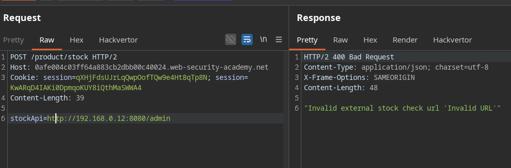
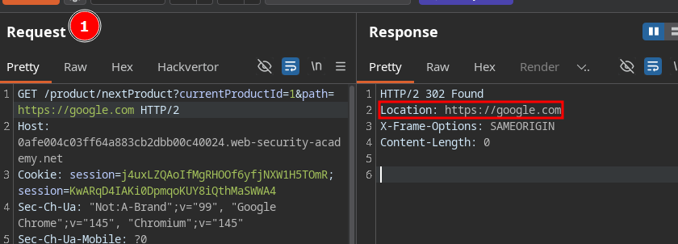
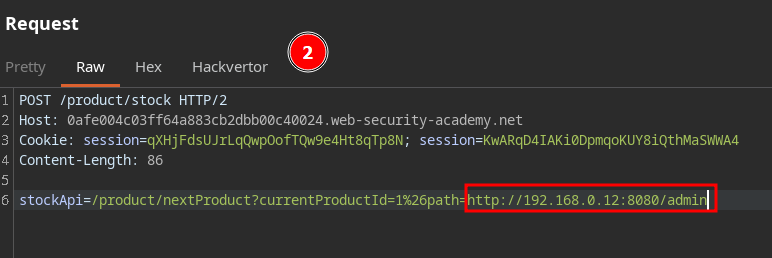

# SSRF with filter bypass via open redirection 

In this lab, we identify that the stock check functionality performs a server-side fetch to an internal resource, returning its contents in the response.
When attempting to point the request to an external resource, the application blocks it.

We then discover an open redirect vulnerability in the "next product" navigation functionality.

By supplying the open redirect as the URL in the stock check functionality, we redirect the server-side request to our target external resource. The filter is bypassed because the block is applied to the initial input, not to the final destination after the redirect — and since the request originates from the server itself, it follows the redirect transparently.

