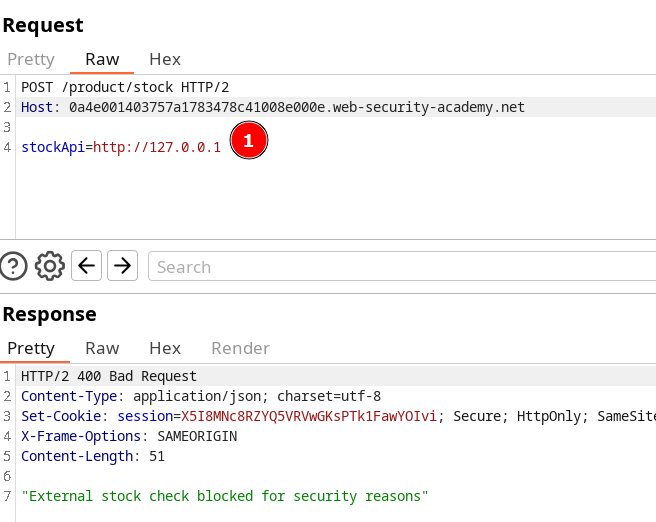
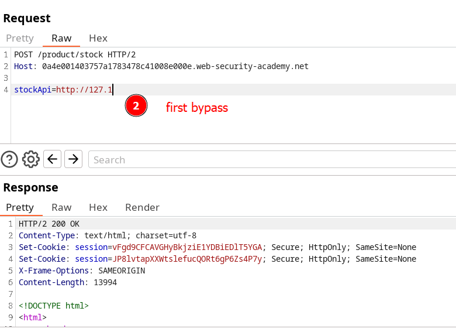
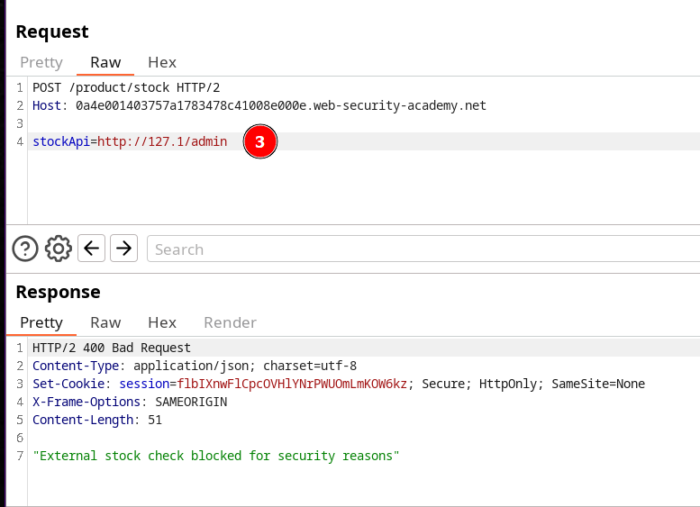
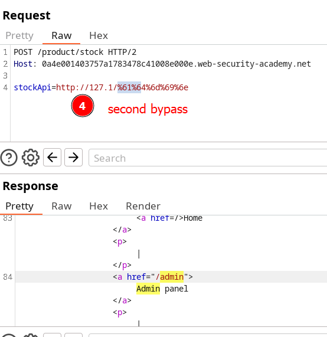

# SSRF with blacklist-based input filter  (encoding)

In this lab, we encounter a product stock check feature. This is performed via a request to an internal resource. 
We can exploit this behavior to attempt a Server-Side Request Forgery (SSRF) attack.

